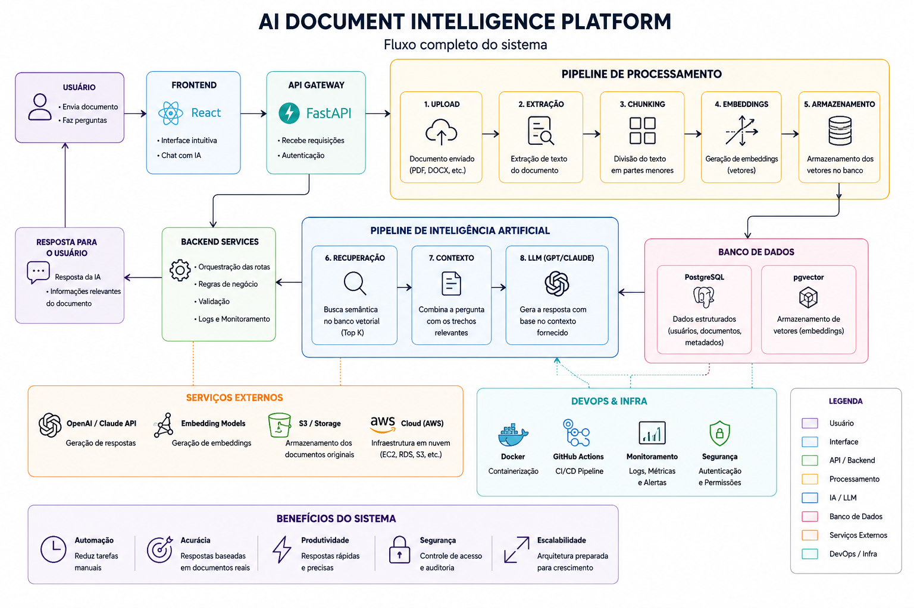

<div align="center">

# 🧠 AI Document Intelligence Platform

### Converse com seus documentos usando Inteligência Artificial

*Envie um PDF, faça perguntas e receba respostas fundamentadas no conteúdo do documento — com tecnologia RAG (Retrieval-Augmented Generation).*

<br>


</div>

---

## 📖 Sobre o projeto

A **AI Document Intelligence Platform** é um sistema que recebe documentos em PDF, compreende o conteúdo com IA e responde perguntas sobre eles.

Em vez de procurar informação manualmente (um `Ctrl+F` glorificado que só acha palavras exatas), o sistema busca por **significado**: você pergunta em linguagem natural e ele encontra os trechos mais relevantes do documento, mesmo que você não use as mesmas palavras que estão no texto. A resposta é então gerada por um modelo de linguagem, **fundamentada apenas no conteúdo do documento** — reduzindo o risco de respostas inventadas.

> 💡 **Por que isso importa?** Imagine perguntar "qual o prazo de entrega?" a um contrato de 80 páginas e receber a resposta exata, com a indicação de onde ela foi encontrada. Esse é o poder do RAG aplicado a documentos.

---

## ✨ Destaques

- 🔍 **Busca semântica** — encontra informação por significado, não por palavra-chave, usando embeddings e similaridade de cosseno.
- 🔌 **Arquitetura de providers trocáveis** — alterne entre **OpenAI**, **Claude** e **Ollama** (local) mudando apenas o arquivo `.env`, sem tocar no código.
- 🆓 **Roda 100% local e gratuito** — com Ollama + embeddings locais (`sentence-transformers`), sem custo de API e sem enviar seus dados para a nuvem.
- 🧩 **Chunking inteligente** — divide o texto respeitando fronteiras naturais (parágrafos e frases) para preservar o sentido.
- 📌 **Respostas rastreáveis** — cada resposta indica de quais trechos do documento ela foi extraída.
- 🐘 **Banco vetorial de verdade** — PostgreSQL com a extensão **pgvector** para busca vetorial eficiente diretamente no banco.
- 🌐 **API REST com FastAPI** — endpoints para upload, perguntas e consulta, com documentação interativa automática (Swagger UI).
- 🐳 **Sobe com um comando** — toda a stack (API + banco) orquestrada via Docker Compose; roda igual em qualquer máquina.

---

## 🖼️ Arquitetura

<div align="center">



</div>

---

## 🏗️ Como funciona (o fluxo RAG)

O sistema tem dois fluxos principais: **ingestão** (guardar o documento) e **consulta** (perguntar sobre ele).

### 1️⃣ Ingestão — transformando o PDF em conhecimento pesquisável

```
📄 PDF  →  📝 Extração de texto  →  ✂️ Chunking  →  🔢 Embeddings  →  🐘 Banco vetorial
```

O documento é lido, o texto é dividido em pedaços (*chunks*) inteligentes, cada pedaço é convertido em um vetor numérico (*embedding*) que captura seu significado, e tudo é armazenado no PostgreSQL + pgvector.

### 2️⃣ Consulta — respondendo perguntas (RAG)

```
❓ Pergunta
     │
     ▼
🔢 Vetoriza a pergunta
     │
     ▼
🔍 Busca os chunks mais similares  ──►  🐘 pgvector (similaridade de cosseno)
     │
     ▼
🧩 Monta o prompt com o contexto encontrado   (Augmented)
     │
     ▼
🤖 LLM gera a resposta baseada no contexto     (Generation)
     │
     ▼
✅ Resposta + fontes (trechos de origem)
```

Isso é o **RAG — Retrieval-Augmented Generation**:
- **R**etrieval → recupera os trechos relevantes do documento
- **A**ugmented → enriquece a pergunta com esse contexto
- **G**eneration → o modelo gera a resposta ancorada no que foi recuperado

---

## 🛠️ Stack tecnológica

| Camada | Tecnologia | Papel |
|:---|:---|:---|
| **Backend** | Python + FastAPI | API e lógica da aplicação |
| **Banco de dados** | PostgreSQL + pgvector | Armazenamento e busca vetorial |
| **ORM** | SQLAlchemy | Modelagem e acesso ao banco |
| **Leitura de PDF** | pypdf | Extração de texto dos documentos |
| **LLMs** | OpenAI · Claude · Ollama | Geração das respostas |
| **Embeddings** | OpenAI · sentence-transformers | Vetorização do texto |
| **Infraestrutura** | Docker + Docker Compose | Ambiente reproduzível |

---

## 🔌 API

Depois de subir o projeto, a documentação interativa (Swagger UI) fica disponível em **`http://localhost:8000/docs`** — dá para testar todos os endpoints direto no navegador, sem precisar de terminal.

| Método | Rota | Descrição |
|:---|:---|:---|
| `POST` | `/documents` | Envia um PDF e dispara o pipeline de ingestão |
| `POST` | `/ask` | Faz uma pergunta e recebe a resposta + as fontes |
| `GET` | `/documents` | Lista os documentos já enviados |
| `GET` | `/documents/{id}` | Consulta o status de um documento específico |

**Exemplo — perguntando ao documento:**

```bash
curl -X POST http://localhost:8000/ask \
  -H "Content-Type: application/json" \
  -d '{"question": "o que é um banco de dados vetorial?"}'
```

```json
{
  "answer": "Um banco de dados vetorial é uma base de dados que busca por similaridade...",
  "sources": [
    { "chunk_index": 6, "document_id": 1, "preview": "..." }
  ]
}
```

---

## 📂 Estrutura do projeto

```
ai-doc-platform/
├── backend/
│   ├── app/
│   │   ├── config.py            # Configuração central (lê do .env)
│   │   ├── init_db.py           # Liga o pgvector e cria as tabelas
│   │   ├── main.py              # Ponto de entrada da API (FastAPI)
│   │   │
│   │   ├── db/
│   │   │   ├── session.py       # Conexão, sessão e Base do SQLAlchemy
│   │   │   └── models.py        # Tabelas: Document e Chunk
│   │   │
│   │   ├── providers/           # 🔌 Arquitetura de providers trocáveis
│   │   │   ├── base.py          # Interfaces abstratas (LLM e Embedding)
│   │   │   ├── openai_llm.py         # LLM via OpenAI
│   │   │   ├── claude_llm.py         # LLM via Claude (Anthropic)
│   │   │   ├── ollama_llm.py         # LLM local via Ollama
│   │   │   ├── openai_embeddings.py  # Embeddings via OpenAI
│   │   │   ├── local_embeddings.py   # Embeddings locais (offline)
│   │   │   └── factory.py       # Seleciona o provider conforme o .env
│   │   │
│   │   ├── services/
│   │   │   ├── chunking.py      # Divisão inteligente do texto
│   │   │   └── ingestion.py     # Pipeline: PDF → chunks → vetores → banco
│   │   │
│   │   ├── core/
│   │   │   ├── retrieval.py     # Busca vetorial (similaridade de cosseno)
│   │   │   └── rag.py           # Orquestração do RAG
│   │   │
│   │   └── api/                 # 🌐 Camada de API (FastAPI)
│   │       ├── routes.py        # Rotas: upload, ask, list, status
│   │       └── schemas.py       # Contratos de entrada e saída (Pydantic)
│   │
│   ├── Dockerfile               # Receita da imagem do backend
│   ├── .dockerignore
│   ├── requirements.txt
│   └── .env.example
│
├── frontend/                    # Interface do usuário (em construção)
├── docker-compose.yml           # Orquestra backend + banco (pgvector)
└── README.md
```

---

## 🚀 Como rodar

> **Pré-requisitos:** [Docker Desktop](https://www.docker.com/products/docker-desktop/) e — para o modo local gratuito — [Ollama](https://ollama.com/download) instalado e em execução na sua máquina.

### 🐳 Opção 1 — Com Docker (recomendado)

Sobe a **aplicação inteira** (API + banco vetorial) de uma vez. As tabelas são criadas automaticamente na primeira execução.

```bash
# 1. Clone o repositório
git clone https://github.com/isacicilio/ai-doc-platform.git
cd ai-doc-platform

# 2. (Modo local) baixe o modelo no Ollama, que roda na sua máquina
ollama pull llama3.2

# 3. Suba tudo com um comando
docker compose up --build
```

Pronto! Acesse a documentação interativa em **http://localhost:8000/docs**.

> ℹ️ No modo local, o Ollama roda **nativo na sua máquina** (fora do Docker) e o container o alcança via `host.docker.internal` — já configurado no `docker-compose.yml`. A primeira execução baixa o PyTorch e o modelo de embeddings, então demora um pouco; as seguintes são rápidas.

### 🐍 Opção 2 — Desenvolvimento local (com hot-reload)

Ideal para desenvolver, com recarregamento automático a cada alteração no código.

```bash
# 1. Suba apenas o banco
docker compose up -d db

# 2. Ambiente Python
cd backend
python -m venv .venv
.\.venv\Scripts\Activate.ps1     # Windows (PowerShell)
# source .venv/bin/activate      # Linux / macOS
pip install -r requirements.txt

# 3. Configure o ambiente e inicialize o banco
cp .env.example .env             # ajuste conforme a seção "Configuração"
python -m app.init_db

# 4. Suba a API com hot-reload
uvicorn app.main:app --reload
```

---

## ⚙️ Configuração

Toda a configuração vive no arquivo `.env`. A grande vantagem da arquitetura: **trocar de provider é só mudar uma linha**.

### 🆓 Modo local (gratuito, sem nuvem)

```env
LLM_PROVIDER=ollama
EMBEDDING_PROVIDER=local
EMBEDDING_MODEL_LOCAL=all-MiniLM-L6-v2
EMBEDDING_DIM=384
OLLAMA_MODEL=llama3.2
OLLAMA_BASE_URL=http://localhost:11434
```

### ☁️ Modo OpenAI

```env
LLM_PROVIDER=openai
EMBEDDING_PROVIDER=openai
OPENAI_API_KEY=sua-chave-aqui
EMBEDDING_MODEL_OPENAI=text-embedding-3-small
EMBEDDING_DIM=1536
```

> ⚠️ **Regra de ouro:** o valor de `EMBEDDING_DIM` **precisa** bater com o modelo de embedding escolhido.
> `text-embedding-3-small` = **1536** · `all-MiniLM-L6-v2` = **384**.
> Se você mudar o modelo depois de já ter criado as tabelas, é preciso recriá-las com a nova dimensão.

---

## 🗺️ Roadmap

O projeto está sendo construído em blocos, na ordem de dependências:

- [x] **Bloco 1** — Fundação (configuração e dependências)
- [x] **Bloco 2** — Banco de dados com pgvector
- [x] **Bloco 3** — Providers de LLM e embeddings
- [x] **Bloco 4** — Ingestão (PDF → chunks vetorizados)
- [x] **Bloco 5** — Core RAG (busca semântica + geração)
- [x] **Bloco 6** — API (rotas e endpoints com FastAPI)
- [x] **Bloco 7** — Orquestração completa via Docker
- [ ] **Bloco 8** — Frontend e DevOps &nbsp;🚧 *em andamento*

---

## 🎯 Conceitos demonstrados

Este projeto foi construído como peça de portfólio para a área de **AI Engineering**, e demonstra na prática:

- **RAG (Retrieval-Augmented Generation)** implementado do zero, entendendo cada etapa
- **Bancos vetoriais** e busca por similaridade semântica
- **Arquitetura desacoplada** com o padrão de providers plugáveis (*dependency injection* e *factory*)
- **API REST** com FastAPI, validação por schemas e documentação automática
- **Containerização e orquestração** com Docker e Docker Compose
- **Engenharia de software** — separação de responsabilidades, configuração centralizada, tratamento de erros
- **Mitigação de alucinação** ancorando o modelo no contexto recuperado

---

<div align="center">

### 👩‍💻 Autora

**Isabela Cicilio de Andrade**

Estudante de Ciência da Computação · Tecnologia · Inteligência Artificial

[](https://github.com/isacicilio)
[](https://www.linkedin.com/in/isacicilio)

<br>

⭐ *Se este projeto te interessou, deixe uma estrela no repositório!*

</div>
